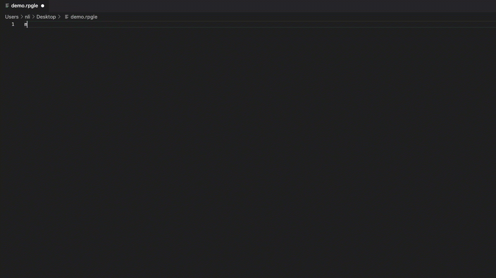

# RPG README

RPG for IBM i is syntax for ILE FREE RPG from version 7.1 and above

The RPG language is widely used on the IBM i platform. With this extension and the included snippets - you can produce RPG ILE code in no time. 

Follow this project at
 
https://github.com/NielsLiisberg/RPG-for-VSCode

Best regards

Niels Liisberg 2016-2021

Thank you for your contributions:
Aaron Bartel, 
Christian Jørgensen, 
Andreas Louv, 

## Known Issues
None so far

## Release Notes

The compile is done with the IceBreak server, however a ssh version is on its way.

### 0.2.0
Adding snippets and update syntax 

### 0.1.1
Compile via node.js module via IceBreak.
fix for all free RPG (CJ)

### 0.1.0
Initial release of RPG
